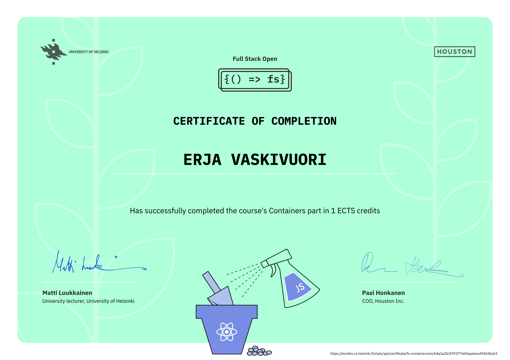

# Fullstack Open - Containers 

This repository contains my submissions for the Containers part of the Fullstack Open course. In this part, I learned how to package code into containers and use them as a foundation for developing, running, and connecting different services.

## What I Learned

### 🐳 Docker basics

* How to write Dockerfiles for different services.
* Differences between development and production Dockerfiles.
* Using multi-stage builds to keep production images smaller and cleaner.
* How to choose certain base image (e.g. `-alpine`, `-slim`, or full versions).
* Debugging issues whether it is related to container itself or connections between containers.

### 🔄 Development in containers

* Running projects in containers while still being able to edit files locally.
* Using volume mounts so local changes reflect inside the container.
* Handling platform-specific issues (Mac vs Linux).

### 🌐 Multiple services with Docker Compose

* Defining a full stack setup with a frontend, backend, and supporting services.
* Using `docker-compose.yml` to orchestrate containers like:

  * Node/Express backend
  * React frontend
  * MongoDB
  * Redis

### 📦 Production setup

* Building optimized frontend bundles and serving them via Nginx.
* Configuring nginx.conf to:

  * Serve static frontend assets.
  * Proxy API requests to the backend.
  * Add security headers and enable gzip compression.

## Reflection 🧠

Before this course, I had used Docker and Docker Compose in projects, but I didn't have much experience in creating Dockerfiles and compositions from scratch. Now I feel much more confident in doing so.

After completing these exercises:

* I can now containerize my apps so they run in consistent environments.
* I know how to set up both dev containers (with hot reloads and local volumes) and prod containers (small, optimized, immutable).
* I understand how containers make it easy to combine multiple services and experiment with tools like databases and reverse proxies.

# Certificate

